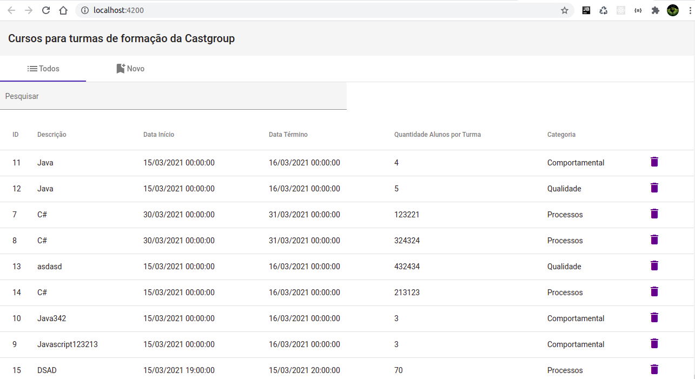
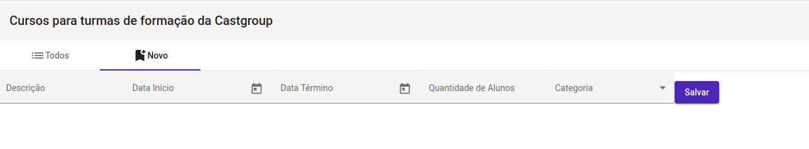

# avaliacao-app

-O projeto foi criado através do comando ng new avaliacao-app. 
-Foi criado o component e o service através do comando ng g c curso e ng g s curso. 
-No arquivo ts service foi criado os metódos para realizar as requições com HttpClient. 
-Foi utilizado o Angular Material para criação dos componentes. 

 
 
